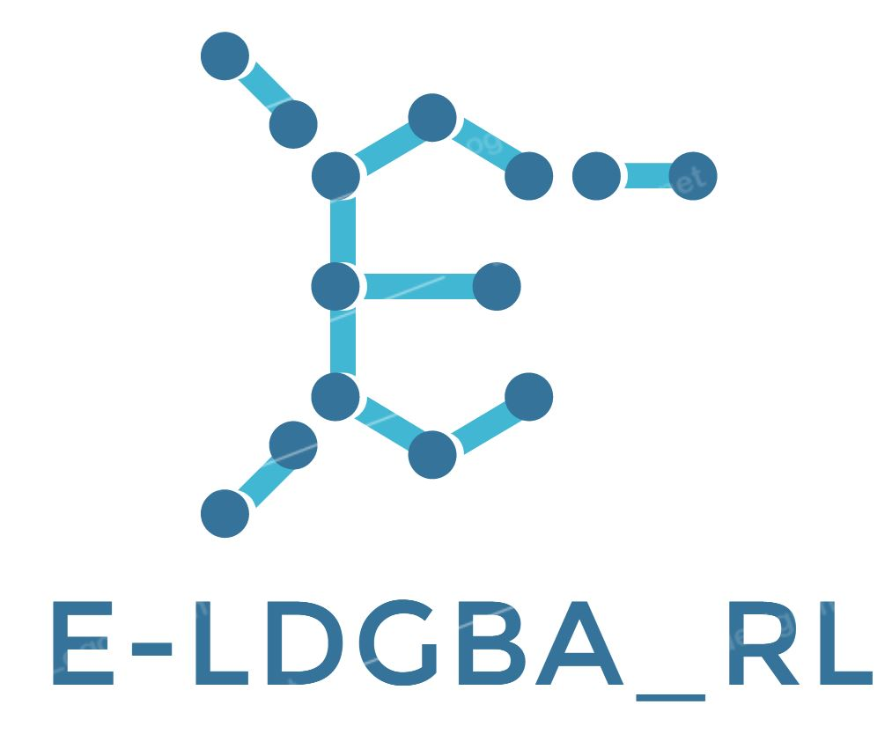

<p align="center">
    
</p>

# E-LDGBA-LTL

The repository implements a Reinforcement Learning Task on a custom environment using temporal logic specifications. The project is based on the paper "[Reinforcement Learning Based Temporal Logic Control with Maximum Probabilistic Satisfaction](https://arxiv.org/abs/2010.06797)" (Mingyu Cai et al.) 

The project applies a standard Reinforcement Learning algorithm based on the lcrl and csrl implementation provided at [LCRL](https://github.com/grockious/lcrl) and [CSRL](https://github.com/alperkamil/csrl).
The reference of lcrl and csrl implementation:
* Hasanbeig, M. , Abate, A. and Kroening, D, "Logically-Constrained Reinforcement Learning", CoRR abs/1801.08099, 2018. [[PDF]](https://arxiv.org/pdf/1801.08099.pdf)
* Bozkurt, Alper Kamil, Yu Wang, Michael M. Zavlanos, and Miroslav Pajic, "Control synthesis from linear temporal logic specifications using model-free reinforcement learning", ICRA, 2020. [[PDF]](https://ieeexplore.ieee.org/abstract/document/9196796?casa_token=lBgma99ebewAAAAA:kZ7lMUqWEV-TG_yKahMhbIOmIQ-8AW0FZjUHJTIeem30PbVL0ong6b7q9tJOrDY77dD8eS1YIw)

[Project Webpage](https://github.com/mingyucai/E-LDGBA_RL/)

## Publications
* Cai, Mingyu, Shaoping Xiao, and Zhen Kan, "Reinforcement Learning Based Temporal Logic Control with Maximum Probabilistic Satisfaction", arXiv preprint arXiv:2010.06797 (2020). [[PDF]](https://arxiv.org/abs/2010.06797)
* Cai, Mingyu, Hao Peng, Zhijun Li, and Zhen Kan, "Learning-based probabilistic LTL motion planning with environment and motion uncertainties", IEEE Transactions on Automatic Control (2020). [[PDF]](https://ieeexplore.ieee.org/abstract/document/9133331?casa_token=NHKWObUoH1gAAAAA:7LiLaAw6eKK0xoDnuJJbkgD9IpQPSHspUrD8UFfqS8qI8hn5zLwC64y7SSOtecC3i6GhFpovsg)

## Results
The agent have been trained on the task: go to goal-1 and then to goal-2 with maximum probability


## Installation and Usage
Clone this repository and install the coressponding dependencies:
```
git clone https:https://github.com/mingyucai/E-LDGBA_RL
```
Execute the example:
```
python3 main.py --env 'SlipperyGrid' --layout 'layout_1' --property 'g1-then-g2' 
```


## LTL-to-Automaton:
This benchmark shows an E-LDGBA built from LDGBA. 
As for more samples, the LTL can be converted to LDGBA or LDBA by
excellent tool OWL, which is available at (https://owl.model.in.tum.de/try/).

## Reference
Please use this bibtex entry if you want to cite this repository in your publication:

```
@article{cai2020reinforcement,
  title={Reinforcement Learning Based Temporal Logic Control with Maximum Probabilistic Satisfaction},
  author={Cai, Mingyu and Xiao, Shaoping and Kan, Zhen},
  journal={arXiv preprint arXiv:2010.06797},
  year={2020}
}

```

